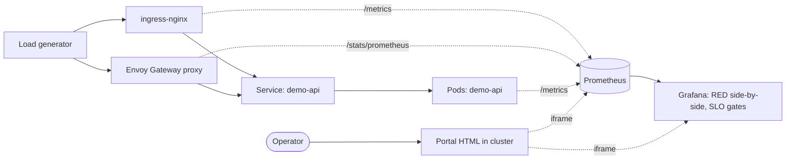
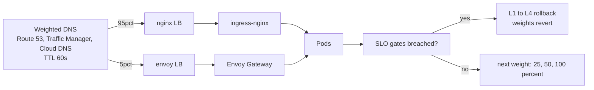

# Architecture

## Why parallel, not in-place

A safe ingress migration is not a config swap. Both controllers serve real traffic during the cutover so the new path can be **proven, not assumed**.



Same backend. Two ingress paths. One dashboard. One policy doc.

### Migration weight flow (DNS-controlled cutover)



## Control plane vs data plane

```
ingress-nginx                            Envoy Gateway
─────────────                            ─────────────
controller pod   (control + data fused)  Envoy Gateway controller pod   (control plane)
                                         Envoy proxy pods               (data plane)
                                                  ▲
                                                  │ xDS (gRPC, push)
                                         envoy-gateway controller
```

Envoy decouples the brain (Envoy Gateway controller — watches Gateway/HTTPRoute, compiles config, pushes via xDS) from the muscle (Envoy proxy pods — serve user traffic). Killing the controller does not stop traffic; Envoys keep serving on last-known config.

## Why Gateway API, not the frozen Ingress API

| | Ingress (v1, frozen) | Gateway API (GA, 1.28+) |
|---|---|---|
| Resource shape | one `Ingress` + vendor annotations | `GatewayClass` → `Gateway` → `HTTPRoute` |
| Traffic split | annotation-only | first-class `backendRefs` with weights |
| Header / mirror | vendor-specific | native filters |
| Roles | mixed | platform owns Gateway; app team owns HTTPRoute |
| Future | maintenance only | active development |

The migration is also a move from a frozen API to the modern data-model.

## Observability

- **Prometheus** scrapes ingress-nginx controller `/metrics` and Envoy proxy `/stats/prometheus` via two ServiceMonitors.
- The **demo-api** backend exposes `/metrics` natively (Flask + `prometheus_client`) and emits OTel traces.
- **Grafana** renders a side-by-side dashboard (rate / errors / p99) plus single-stat panels for Envoy-specific signals (xDS sync, outlier ejections, CB overflow, healthy endpoints).

## What this lab is NOT

- Not multi-tenant — single `demo` namespace, one workload.
- Not multi-cluster — single local k3d node.
- Not a full mesh — north-south only, no Istio sidecars.

That keeps the focus on the migration mechanics.
